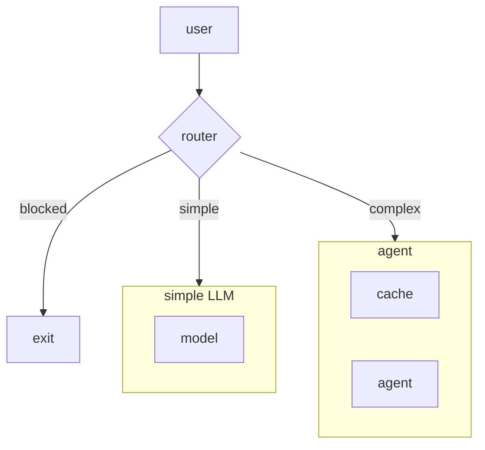
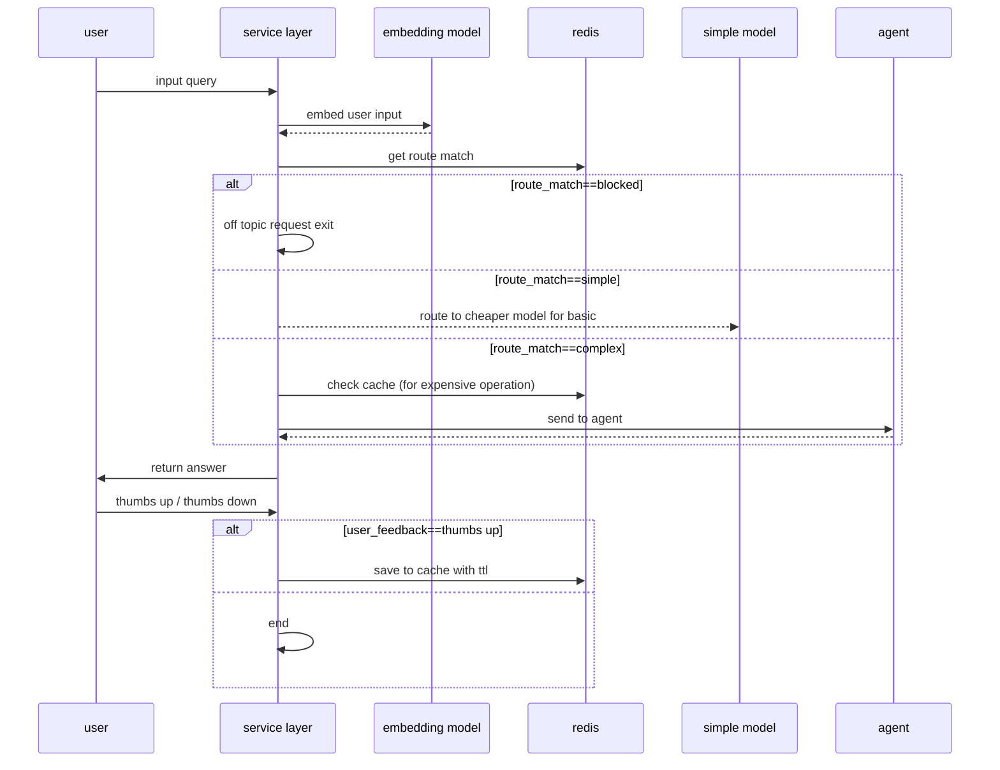
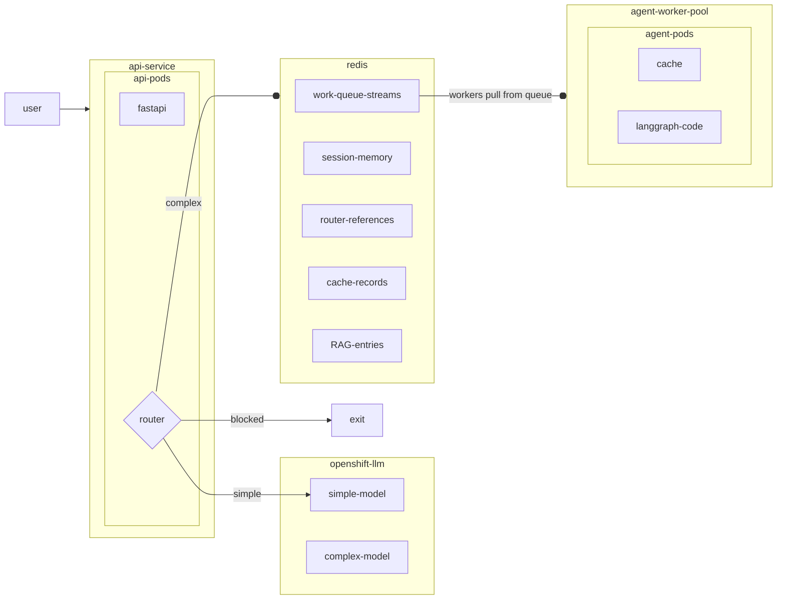

# Reduce insurance agent LLM costs with OpenShift AI and Redis

Reduce LLM costs with intelligent routing and caching with Redis Enterprise&reg; and Red Hat OpenShift AI&reg;.

## Table of contents

- [Overview](#overview)
  - [Architecture](#architecture)
  - [Production view](#production-view)
- [What is getting deployed](#what-is-getting-deployed)
- [Streamlit demo UI](#streamlit-demo-ui)
- [Requirements](#requirements)
  - [Minimum hardware requirements](#minimum-hardware-requirements)
  - [Minimum software requirements](#minimum-software-requirements)
- [Installation](#installation)
  - [Deploy on OpenShift (Helm)](#deploy-on-openshift-helm)
    - [Uninstall from OpenShift](#uninstall-from-openshift)
  - [Run locally](#run-locally)
    - [Uninstall local deployment](#uninstall-local-deployment)
- [References](#references)
- [Tags](#tags)

## Overview

Let's imagine we are tasked with building an insurance claims assistant. The business metrics show that a high volume of questions are similar in nature and could be responded to quickly by an AI agent. However, given the rising costs from model providers, ops wants to make sure that token spend is being managed efficiently. Meanwhile, the engineering team is very excited to build out an agent workflow with LangGraph and all the bells and whistles.

From our interaction data, we know that not all input queries require the latest reasoning model to answer, and that there are likely many FAQ-type questions for which we don't need to constantly regenerate answers.

### Architecture



The router in the above diagram refers to the `SemanticRouter` made available from the [Redis vector library](https://redis.io/docs/latest/integrate/redisvl/), which uses a combination of vector-enabled search techniques to perform classification on the input query. Invoking a semantic router in this way runs in milliseconds and requires no LLM tokens for a quick first-cut intent detection. In this example, our three hypothetical routes will be `blocked`, `simple`, and `complex`, wherein simple or vague requests (like "hello" or "I need help") go to a cheaper non-reasoning LLM, more complex queries (like "I was curious if policy xyz applies in my state") go to the full-featured agent, and off-topic requests (like "answer my python coding question") get evicted.

In a similar vein, we will make use of the `SemanticCache` from the Redis vector library to store previously generated and approved responses from the agent to reduce repeat generations.

The final flow is encapsulated in the following sequence diagram:



In `demo/notebooks/`, `01_agent.ipynb` and `02_router_cache.ipynb` cover setting up this flow. The reusable agent used by `02_router_cache.ipynb` lives in `demo/shared/insurance_bot.py`.

### Production view

Finally, we want to provide insight into what managing a deployment like this on Red Hat OpenShift&reg; would look like from a production standpoint, where a system like this has to be able to handle many concurrent requests. Notebook `03_async_work_queue.ipynb` shows how you can easily distribute your work across many horizontally scalable workers. In practice, this would enable an architecture with multiple workers backed by a distributed Redis layer for pods to retrieve semantic and episodic memory, as well as cached data.

The following diagram shows a scalable solution where simple requests are sent to a generic model and complex requests are routed to the cache. 



## What is getting deployed

The Helm chart under **`deploy/helm`** (release name **`redis-notebook`**) provisions the full quickstart stack on OpenShift. A plain **`make deploy`** installs the core pieces; optional targets add operators or the conference demo UI.

| Component | Default | Purpose |
|-----------|---------|---------|
| **Jupyter workbench** | On (`notebook.enabled`) | Kubeflow **`Notebook`** CR (OpenShift AI) or plain **`Deployment`** + **`Route`** (`notebook.kind=Deployment`). Git-sync copies **`demo/`** into the workspace so you can run the notebooks. |
| **Redis Enterprise** | On (`redis.useRedisEnterpriseOperator`) | **`RedisEnterpriseCluster`** + **`RedisEnterpriseDatabase`** for vector search, semantic router, cache, LangGraph memory, and work queues. Alternatives: OT-CONTAINER-KIT operator + Redis CR, or external **`REDIS_URL`**. |
| **ROI Streamlit dashboard** | On (`roiDashboard.enabled`) | Five-tab UI at **`demo/app.py`** on port **8501** (Tab 0 = in-app guide; Tabs 1–4 = readiness through production queue) with its own PVC and OpenShift Route. |
| **Insurance RAK worker** | On (`insuranceWorker.enabled`) | Background **`rak worker`** Deployment that consumes Tab 4 (Production Queue) tasks from Redis Streams (`insurance_worker:tasks`). |
| **Git-sync init containers** | On | Clone this repo and copy **`demo/`** into notebook and dashboard pods at startup. |
| **RBAC** | On | ServiceAccount + namespace **`edit`** RoleBinding for the workbench. |

**Not installed by default** (enable via Makefile or `values.yaml`):

- **Redis Enterprise operator via OLM** — `make deploy-redis-enterprise-olm` or `redis.enterprise.olm.enabled: true`
- **Red Hat OpenShift AI operator via OLM** — `make deploy-openshift-ai-operator` or `openshiftAI.operator.enabled: true`
- **Standalone production API** — the chart wires notebooks, Redis, the Streamlit dashboard, and the worker; it does not deploy a separate FastAPI ingress layer.

**Secrets:** create **`deploy/helm/values-secret.yaml`** from **`values-secret.example.yaml`** with at least **`secrets.model.apiKey`**. The chart injects **`SIMPLE_MODEL_*`**, **`COMPLEX_MODEL_*`**, and **`REDIS_URL`** into the notebook, dashboard, and worker.

**Useful deploy targets:**

```bash
make -f deploy/helm/Makefile deploy-all                  # notebook + Redis + dashboard + worker (defaults)
```

Full chart layout, operator modes, and troubleshooting: **[deploy/README.md](deploy/README.md)**.

## Streamlit demo UI

The **Cost-Optimized Insurance Assistant** (`demo/app.py`) is a five-tab Streamlit dashboard: an in-app **UI Guide** (Tab 0) plus four interactive scenarios that mirror the notebooks — readiness checks, baseline agent, router + cache, and production queue. Run it locally with Streamlit or open the OpenShift Route after deploy.

```bash
cd demo
pip install -r requirements.txt --extra-index-url https://pypi.org/simple
streamlit run app.py
```

| Tab | Label | Notebook |
|-----|-------|----------|
| 0 | 📖 UI Guide | — (renders `docs/embeded_guide.md`) |
| 1 | 🚀 Readiness Check | `00_initialization.ipynb` |
| 2 | 🤖 Complex Agent | `01_agent.ipynb` |
| 3 | ⚖️ Router & Cache | `02_router_cache.ipynb` |
| 4 | 🏭 Production Queue | `03_async_work_queue.ipynb` |

Tab-by-tab walkthrough, preset buttons, cost metrics, and worker requirements: **[docs/streamlit-ui-guide.md](docs/streamlit-ui-guide.md)** (in-app Tab 0 renders **[docs/embeded_guide.md](docs/embeded_guide.md)**).

## Requirements

### Minimum hardware requirements

| Node Type     | Qty | vCPU | Memory (GB) |
|---------------|-----|------|-------------|
| Control Plane | 3   | 8    | 16          |
| Worker        | 2   | 8    | 32          |

> [!NOTE]
> A GPU is not required for this quickstart

### Minimum software requirements

This quickstart was tested with the following software versions:

| Software                           | Version  |
| ---------------------------------- |:---------|
| OpenShift                          | 4.20+    |
| OpenShift AI                       | 3.4+     |
| Redis Enterprise                   | 7        |
| helm                               | 3.17+    |

## Installation

### Deploy on OpenShift (Helm)

**Full deployment guide:** [deploy/README.md](deploy/README.md) — chart layout, `make` targets, how **`values.yaml`** and **`values-secret.yaml`** are merged for **`helm upgrade`**, Redis modes, RBAC, and troubleshooting.

This repository includes a **Helm chart** under **`deploy/helm`** (chart name **`redis-notebook`**) that can install:

- a **Jupyter workbench** with a persistent workspace — by default a Kubeflow **`Notebook`** CR (`notebook.kind=Notebook`, requires **Red Hat OpenShift AI** / Open Data Hub), or a plain `Deployment` + `Service` + OpenShift `Route` when `notebook.kind=Deployment` (any OpenShift cluster),
- a **git-sync init container** on the notebook pod that clones this repo and copies **`demo/`** into the workspace,
- **Redis Enterprise** in-cluster by default (`RedisEnterpriseCluster` + `RedisEnterpriseDatabase`), with optional **OT-CONTAINER-KIT** operator + Redis CR or an **external** `REDIS_URL` instead.

**Before `make deploy`:** create **`deploy/helm/values-secret.yaml`** (gitignored) from **`deploy/helm/values-secret.example.yaml`** and set real values for `secrets.model.apiKey` and the other `secrets.model.*` keys. **`make deploy`** runs **`check-secrets`** (file exists) and **`validate-secrets`** (merged values must not be null/empty for required fields; requires **PyYAML**: `python3 -m pip install pyyaml`).

```bash
cp deploy/helm/values-secret.example.yaml deploy/helm/values-secret.yaml
# Edit deploy/helm/values-secret.yaml

make -f deploy/helm/Makefile help
make -f deploy/helm/Makefile deploy-all
# Optional: chart-managed Redis Enterprise operator OLM
# make -f deploy/helm/Makefile deploy-all
```
#### Uninstall from OpenShift

```bash
make -f deploy/helm/Makefile uninstall
```

More **helm upgrade** examples, operator modes, and cleanup: [deploy/README.md](deploy/README.md).

### Run locally

The `demo/` folder contains everything needed to exercise the router + cache + agent pattern against a local Redis instance and an OpenAI-compatible API.

#### Requirements

- Python 3.11+ (3.12 is fine)
- **Redis** reachable at `REDIS_URL` (default `redis://localhost:6379`). Use **Redis Stack** if you run **`02_router_cache.ipynb`** (semantic router / cache need search modules). **`01_agent.ipynb`** LangGraph multi-turn memory needs **`langgraph-checkpoint-redis`** (see `demo/scripts/requirements.txt`).
- An API key for your LLM provider (OpenAI by default; override **`MODEL_ENDPOINT`** for OpenShift AI / vLLM / Azure OpenAI–compatible hosts)

**1. Install dependencies**

```bash
cd Reducing-costs-of-AI-with-Redis-Labs
python -m venv .venv && source .venv/bin/activate
pip install -r demo/scripts/requirements.txt --extra-index-url https://pypi.org/simple
```

**2. Configure the environment**

Create a `.env` file at the repository root:

```dotenv
MODEL_API_KEY=sk-...
MODEL_ENDPOINT=https://api.openai.com
SIMPLE_MODEL_NAME=gpt-4.1
COMPLEX_MODEL_NAME=gpt-5
REDIS_URL=redis://localhost:6379
```

**3. Run the notebooks**

```bash
jupyter lab demo/notebooks
```

Run from the **`demo/notebooks`** directory (or ensure that is the notebook working directory) so paths to `data/` and repo-root `.env` resolve as in the notebooks.

| Notebook | What it shows |
|---|---|
| `00_initialization.ipynb` | Optional smoke test: env vars, Redis `PING`, and model endpoint checks. |
| `01_agent.ipynb` | Step-by-step LangGraph ReAct agent (FAQ, policy tools, Redis-backed checkpointer). |
| `02_router_cache.ipynb` | Imports `demo/shared/insurance_bot.py`: semantic router, thumbs-up–only semantic cache, agent with Redis memory. |
| `03_async_work_queue.ipynb` | Uses [redis-agent-kit](https://pypi.org/project/redis-agent-kit/) for an async Redis-backed work queue across workers. |

#### Uninstall local deployment

Local setup has no cluster release. Deactivate the virtualenv and remove it if you no longer need it:

```bash
deactivate
rm -rf .venv
```
## References

* [Redis documentation](https://redis.io/docs/latest/)
* [Red Hat OpenShift AI documentation](https://docs.redhat.com/en/documentation/red_hat_openshift_ai_self-managed)
* [Red Hat OpenShift documentation](https://docs.redhat.com/en/documentation/openshift_container_platform)

## Tags

* **Industry:** Insurance
* **Product:** Red Hat OpenShift AI
* **Use Case:** LLM cost optimization
* **Partner**: Redis Labs
