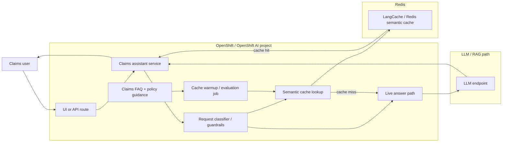

# Reduce insurance claims AI cost with Redis semantic cache

Deploy an insurance claims FAQ assistant on OpenShift AI that serves stable questions from Redis semantic cache and routes live claim questions to a fresh-answer path.

## Overview

This quickstart demonstrates a practical Red Hat + Redis pattern for reducing LLM cost and latency. The starter workload is an insurance claims assistant that handles repetitive FAQ-style questions such as deductible timing, claim documents, rental reimbursement, and windshield guidance.

The assistant classifies incoming questions before answering them:

- stable FAQ and policy-guidance questions go to a cache-first path
- temporal or claim-specific questions bypass semantic cache
- cache misses can fall back to a live model endpoint when configured

This makes the repo a concrete demonstration of where semantic caching works well and where it should not be used.

## Detailed description

Insurance claims support is full of semantically similar questions whose answers do not change very often. Different users ask the same thing in different ways:

- "What documents do I need to file an auto claim?"
- "What paperwork should I have ready for my car insurance claim?"
- "Do I need photos and a police report before I submit my claim?"

These are strong candidates for Redis semantic caching because the phrasing changes more than the answer. By contrast, questions such as "What is the status of my claim today?" or "Who is my adjuster right now?" should not be answered from a semantic cache because the answer can change over time.

This starter app makes that distinction explicit so teams can demonstrate measurable cache-hit savings without over-claiming correctness for transactional workflows.

### See it in action

After deployment, try these two requests:

```bash
curl -s -X POST "$APP_URL/ask" -H 'Content-Type: application/json' \
  -d '{"question":"When do I pay my deductible on an auto claim?"}' | jq

curl -s -X POST "$APP_URL/ask" -H 'Content-Type: application/json' \
  -d '{"question":"What is the current status of my claim today?"}' | jq
```

Expected behavior:

- the deductible question should return a cache-eligible response
- the claim-status question should bypass cache

### Architecture diagrams

The Mermaid source for this diagram is stored in `docs/images/insurance-claims-semantic-cache.mmd`.



## Requirements

### Minimum hardware requirements

This starter does not deploy a model in-cluster. Minimum app resources are:

- CPU: 100m request / 500m limit
- Memory: 256Mi request / 512Mi limit
- Storage: none required beyond normal cluster image pull and log storage

If you connect an external model endpoint, the model runs outside the cluster and does not require local GPU resources.

### Minimum software requirements

- Red Hat OpenShift 4.16+
- Red Hat OpenShift AI 2.13+ for the broader quickstart context
- `oc` CLI
- `helm` 3.x
- `podman` or `docker` to build the starter application image

### Required user permissions

The user should be able to:

- create a project or deploy into an existing namespace
- create Deployments, Services, Routes, ConfigMaps, and Secrets
- run Helm installs and Helm tests in the target namespace

Cluster-admin permissions are not required for the application itself, but may be required in some environments to provision OpenShift AI components or shared model endpoints.

## Deploy

### Prerequisites

Before deploying, ensure you have:

- access to an OpenShift cluster with Routes enabled
- access to an image registry that your cluster can pull from
- optional Redis LangCache endpoint details if you want semantic cache backed by Redis instead of the in-memory FAQ fallback
- optional OpenAI-compatible model endpoint details if you want live cache misses to call a model

### Installation

1. Clone the repository and move into this quickstart:

```bash
git clone https://github.com/rh-ai-quickstart/redhat-ex.git
cd redhat-ex/Reducing-costs-of-AI-with-Redis-Labs
```

2. Build and push the starter image:

```bash
IMAGE="quay.io/<your-org>/redis-insurance-assistant:0.1"
podman build -t "$IMAGE" -f app/Containerfile .
podman push "$IMAGE"
```

3. Create a project:

```bash
PROJECT="redis-insurance-demo"
oc new-project "$PROJECT"
```

4. Install the chart with the starter image:

```bash
helm install redis-insurance ./chart --namespace "$PROJECT" \
  --set app.image.repository="quay.io/<your-org>/redis-insurance-assistant" \
  --set app.image.tag="0.1"
```

5. To enable Redis LangCache, add your LangCache settings:

```bash
helm upgrade --install redis-insurance ./chart --namespace "$PROJECT" \
  --set app.image.repository="quay.io/<your-org>/redis-insurance-assistant" \
  --set app.image.tag="0.1" \
  --set langcache.enabled=true \
  --set langcache.serverUrl="https://<langcache-host>" \
  --set langcache.cacheId="<cache-id>" \
  --set langcache.apiKey="<api-key>"
```

6. To enable live model calls on cache misses, add a compatible endpoint:

```bash
helm upgrade --install redis-insurance ./chart --namespace "$PROJECT" \
  --set app.image.repository="quay.io/<your-org>/redis-insurance-assistant" \
  --set app.image.tag="0.1" \
  --set model.name="granite-3-1-8b-instruct" \
  --set model.endpoint="https://<model-endpoint>" \
  --set model.apiKey="<api-key>"
```

> For a real deployment, prefer a private values file instead of putting API keys directly on the command line.

### Validating the deployment

Run the Helm tests:

```bash
helm test redis-insurance --namespace "$PROJECT"
```

Get the route URL:

```bash
APP_URL="https://$(oc get route redis-insurance-redis-insurance-claims-assistant -n "$PROJECT" -o jsonpath='{.spec.host}')"
echo "$APP_URL"
```

Check health and sample questions:

```bash
curl -s "$APP_URL/healthz" | jq
curl -s "$APP_URL/sample-questions" | jq
```

Warm the Redis cache after install when LangCache is configured:

```bash
curl -s -X POST "$APP_URL/warmup" | jq
```

### Uninstall

To remove the deployment:

```bash
helm uninstall redis-insurance --namespace "$PROJECT"
```

## Repository structure

```text
.
├── app/
│   ├── Containerfile
│   ├── assistant.py
│   ├── server.py
│   └── tests/
├── chart/
│   ├── Chart.yaml
│   ├── values.yaml
│   └── templates/
│       ├── _helpers.tpl
│       ├── configmap.yaml
│       ├── deployment.yaml
│       ├── route.yaml
│       ├── secret.yaml
│       ├── service.yaml
│       ├── test-app-health.yaml
│       └── test-model-access.yaml
├── data/
│   └── insurance_faq.json
├── docs/
│   ├── images/
│   │   └── insurance-claims-semantic-cache.mmd
│   └── redhat-insurance-semantic-cache-proposal.md
├── 04_langcache_semantic_caching.ipynb
├── redis-spec.md
└── README.md
```

## References

- Redis LangCache semantic caching notebook: `04_langcache_semantic_caching.ipynb`
- Technical spec and scope: `redis-spec.md`
- Partner proposal: `docs/redhat-insurance-semantic-cache-proposal.md`
- Redis LangCache API examples: https://redis.io/docs/latest/develop/ai/langcache/api-examples/

## Technical details

### Current starter behavior

- stable FAQ questions use a cache-first flow
- temporal or claim-specific questions bypass semantic cache
- if LangCache is not configured, the app falls back to a local curated FAQ dataset
- if a compatible model endpoint is configured, cache misses can call `/v1/chat/completions`

### API endpoints

- `GET /healthz` returns service health and cache configuration state
- `GET /sample-questions` returns example cacheable and bypass questions
- `POST /ask` classifies and answers a question
- `POST /warmup` preloads LangCache with curated FAQ entries

### Important limitations in v1

- this starter is intentionally scoped to stable claims FAQ guidance
- it does not integrate with a real claims system of record
- claim status, payout amount, and adjuster assignment remain live-path use cases
- the evaluation notebook/job described in the spec is still a follow-on implementation item

## Tags

- Title: Reduce insurance claims AI cost with Redis semantic cache
- Description: Deploy an insurance claims FAQ assistant on OpenShift AI that serves stable questions from Redis semantic cache and routes live claim questions to a fresh-answer path.
- Industry: Financial Services / Insurance
- Product: OpenShift AI, OpenShift, Redis
- Use case: semantic caching, cost optimization, generative AI
- Contributor org: Redis