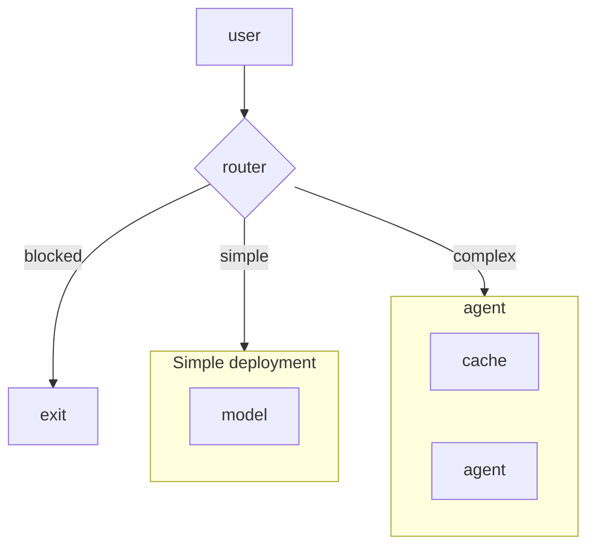
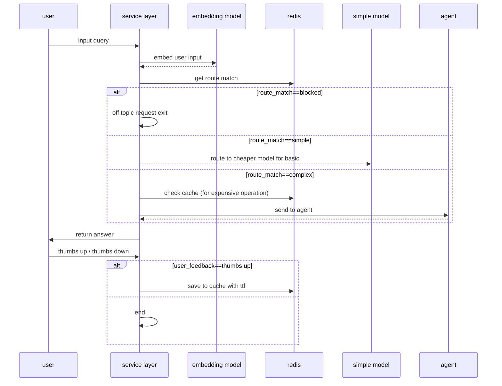

# Create a scalable and cost effecient insurance agent with OpenShift AI and Redis

Deploy an insurance claims FAQ assistant on OpenShift AI that serves stable questions from Redis semantic cache and routes live claim questions to a fresh-answer path.

## Overview

This quickstart demonstrates a practical Red Hat + Redis pattern for production ready stack that also helps reduce LLM cost and latency.

We will build:
- a LangGraph agent for processing insurance claims
- a semantic router to help us quickly classify intent without the latency and cost of an LLM
- a semantic cache to store answers at the top of our paretto chart
- a queue for distributing incoming agent requests across workers

The assistant classifies incoming questions before answering them:

- stable FAQ and policy-guidance questions go to a cache-first path
- temporal or claim-specific questions bypass semantic cache
- cache misses can fall back to a live model endpoint when configured

This makes the repo a concrete demonstration of where semantic caching works well and where it should not be used.

## Detailed description

Insurance claims support is full of semantically similar questions whose answers do not change very often. Different users ask the same thing in different ways:

- "What documents do I need to file an auto claim?"
- "What paperwork should I have ready for my car insurance claim?"
- "Do I need photos and a police report before I submit my claim?"

These are strong candidates for Redis semantic caching because the phrasing changes more than the answer. By contrast, questions such as "What is the status of my claim today?" or "Who is my adjuster right now?" should not be answered from a semantic cache because the answer can change over time.

This starter app makes that distinction explicit so teams can demonstrate measurable cache-hit savings without over-claiming correctness for transactional workflows.

## Run locally

The `demo/` folder contains everything needed to exercise the router + cache + agent pattern against a local Redis instance and OpenAI.

**Prereqs**
- Python 3.11
- A Redis instance reachable at `redis://localhost:6379` (Redis Stack or OSS Redis 7.2+ with the search module)
- An OpenAI API key

**1. Install dependencies**

```bash
cd Reducing-costs-of-AI-with-Redis-Labs
python -m venv .venv && source .venv/bin/activate
pip install -r demo/scripts/requirements.txt
```

**2. Configure the environment**

Create a `.env` file at the root of `Reducing-costs-of-AI-with-Redis-Labs/`:

```dotenv
MODEL_API_KEY=sk-...
SIMPLE_MODEL_NAME=gpt-4.1
COMPLEX_MODEL_NAME=gpt-5
REDIS_URL=redis://localhost:6379
```

**3. Run the notebooks in order**

```bash
jupyter lab demo/notebooks
```

| Notebook | What it shows |
|---|---|
| `01_agent.ipynb` | The complex-path LangGraph agent with FAQ search, policy lookup, and Redis-backed multi-turn memory. |
| `02_router_cache.ipynb` | Wraps the agent with a `SemanticRouter` (blocked / simple / complex) and a `SemanticCache` populated only from 👍 user feedback. |

`01_agent.ipynb` builds the agent inline so every step is explicit; `02_router_cache.ipynb` imports the re-usable version of that same build from `demo/shared/insurance_bot.py`.

### Architecture diagrams




# Sequence perspective
