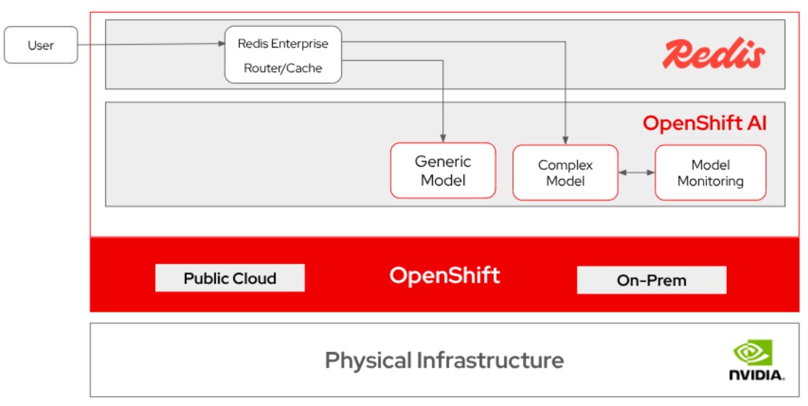
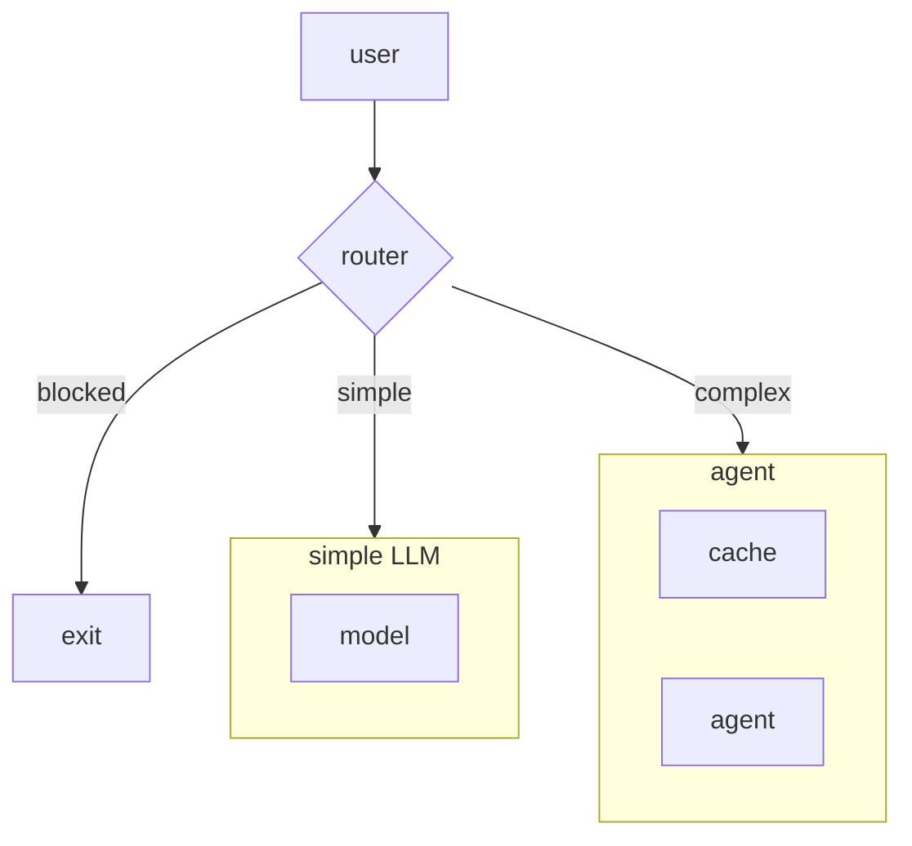
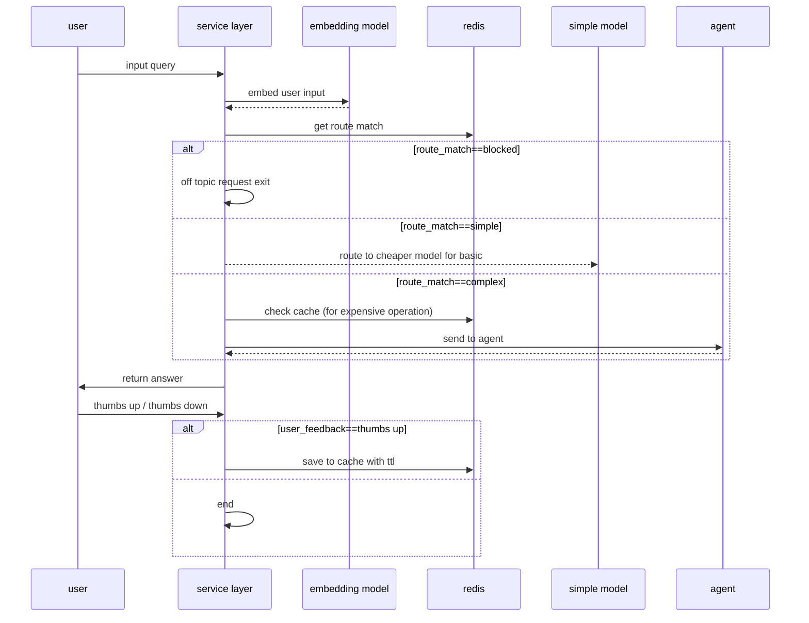
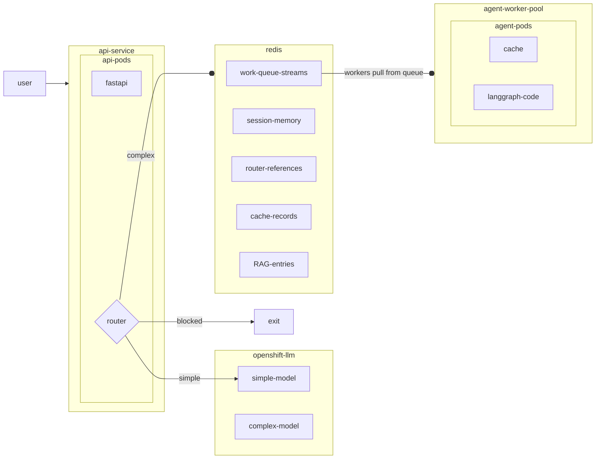

# Optimize insurance agent LLM costs

Reduce LLM costs with intelligent routing and caching with Redis Enterprise&reg; and Red Hat OpenShift AI&reg;.

## Table of contents

- [Detailed Description](#detailed-description)
  - [Architecture](#architecture)
- [Requirements](#requirements)
  - [Minimum hardware requirements](#minimum-hardware-requirements)
  - [Minimum software requirements](#minimum-software-requirements)
- [Deploy](#deploy)
  - [Delete](#delete)
  - [Demo UI](#demo-ui)
- [Technical details](#technical-details)
  - [Flow chart](#flow-chart)
  - [Production view](#production-view)
  - [What is getting deployed](#what-is-getting-deployed)
- [References](#references)
- [Tags](#tags)

## Detailed Description

Insurance companies are turning to AI-powered chatbots to handle the high volume of customer inquiries that flood call centers every day: questions about policy coverage, claims status, deductibles, and filing procedures. An AI claims assistant can dramatically improve response times and free up human agents for the cases that truly need a personal touch. But there is a catch: cost.

When every customer question, whether it is "Hello, I need help" or "Does my homeowner's policy cover water damage from a burst pipe in a detached structure?", is routed to the same large language model, token costs grow quickly. A single powerful model delivers excellent answers, but it also means the insurance company is paying premium prices for routine interactions that don't require that level of sophistication. At the scale of a busy insurance operation, this one-size-fits-all approach can turn a promising AI investment into an unpredictable line item.

The good news is that real-world insurance conversation data reveals two patterns that can be used to bring costs under control. First, a large share of incoming questions are repetitive. Policyholders ask the same things over and over: "What's my deductible?" "How do I file a claim?" "Is this covered under my plan?" Generating a fresh answer from the model every time a customer asks one of these frequently asked questions is wasteful. By introducing a semantic cache, previously answered questions can be recognized and served instantly from stored responses, without ever calling the model. The result is faster response times for policyholders and dramatically lower inference costs for the insurer.

Second, not every question demands the most advanced and most expensive model available. Many inquiries are simple, vague, or conversational: "Hello," "I need help with my account," or "What services do you offer?" These don't need a state-of-the-art reasoning model to answer well. An intelligent routing layer can classify incoming questions on the fly and direct straightforward requests to a smaller, less expensive model, while reserving the full-featured, higher-cost model for genuinely complex questions that benefit from deeper reasoning, like multi-step claims analysis or policy comparison. This way, the insurer only pays for heavy computation when the question truly warrants it.

Together, caching and intelligent routing give insurance companies a practical framework for managing AI costs without sacrificing the quality of the customer experience. Instead of choosing between a capable but expensive agent and a cheap but limited one, the business can deploy both strategically, so that every dollar spent on inference delivers real value to policyholders and the bottom line alike.

### Architecture



## Requirements

### Minimum hardware requirements

| Node Type     | Qty | vCPU | Memory (GB) |
|---------------|-----|------|-------------|
| Control Plane | 3   | 8    | 16          |
| Worker        | 2   | 8    | 32          |

> [!NOTE]
> A GPU is not required for this quickstart

### Minimum software requirements

This quickstart was tested with the following software versions:

| Software                           | Version  |
| ---------------------------------- |:---------|
| OpenShift                          | 4.20+    |
| OpenShift AI                       | 3.4+     |
| Redis Enterprise                   | 7        |
| helm                               | 3.17+    |

## Deploy

The [full deployment guide](deploy/README.md) has details on the deployment and troubleshooting. 

Before running `make deploy` to perform the installation:

1. Create `deploy/helm/values-secret.yaml` by copying `deploy/helm/values-secret.example.yaml`
2. Set real values for `secrets.model.apiKey` and the other `secrets.model.*` keys. 

`make deploy` runs `check-secrets` and `validate-secrets` (merged values must not be null/empty for required fields; requires **PyYAML**: `python3 -m pip install pyyaml`).

```bash
cp deploy/helm/values-secret.example.yaml deploy/helm/values-secret.yaml
# Edit deploy/helm/values-secret.yaml

make -f deploy/helm/Makefile help
make -f deploy/helm/Makefile deploy-all
```

Redis can also be [run locally](docs/run-redis-locally.md) for this demo, if necessary.

### Delete
The quickstart can be uninstalled with the following command.

```bash
make -f deploy/helm/Makefile uninstall
```

### Demo UI

The **Cost-Optimized Insurance Assistant** (`demo/app.py`) is a five-tab dashboard: an in-app **UI Guide** (Tab 0) plus four interactive scenarios that mirror the notebooks — readiness checks, baseline agent, router + cache, and production queue. Run it locally with Streamlit or open the OpenShift Route after deploy.

```bash
cd demo
pip install -r requirements.txt --extra-index-url https://pypi.org/simple
streamlit run app.py
```

| Tab | Label | Notebook |
|-----|-------|----------|
| 0 | 📖 UI Guide | — (renders `docs/embeded_guide.md`) |
| 1 | 🚀 Readiness Check | `00_initialization.ipynb` |
| 2 | 🤖 Complex Agent | `01_agent.ipynb` |
| 3 | ⚖️ Router & Cache | `02_router_cache.ipynb` |
| 4 | 🏭 Production Queue | `03_async_work_queue.ipynb` |

Tab-by-tab walkthrough, preset buttons, cost metrics, and worker requirements: **[docs/streamlit-ui-guide.md](docs/streamlit-ui-guide.md)** (in-app Tab 0 renders **[docs/embeded_guide.md](docs/embeded_guide.md)**).

## Technical details

This section includes some deeper architectural diagrams, call flow sequences and details on exactly what is deployed as part of the quickstart.

### Flow chart



The router in the above diagram refers to the `SemanticRouter` made available from the [Redis vector library](https://redis.io/docs/latest/integrate/redisvl/), which uses a combination of vector-enabled search techniques to perform classification on the input query. Invoking a semantic router in this way runs in milliseconds and requires no LLM tokens for a quick first-cut intent detection. In this example, our three hypothetical routes will be `blocked`, `simple`, and `complex`, wherein simple or vague requests (like "hello" or "I need help") go to a cheaper non-reasoning LLM, more complex queries (like "I was curious if policy xyz applies in my state") go to the full-featured agent, and off-topic requests (like "answer my python coding question") get evicted.

In a similar vein, we will make use of the `SemanticCache` from the Redis vector library to store previously generated and approved responses from the agent to reduce repeat generations.

The final flow is encapsulated in the following sequence diagram:



In `demo/notebooks/`, `01_agent.ipynb` and `02_router_cache.ipynb` cover setting up this flow. The reusable agent used by `02_router_cache.ipynb` lives in `demo/shared/insurance_bot.py`.

### Production view

Finally, we want to provide insight into what managing a deployment like this on Red Hat OpenShift&reg; would look like from a production standpoint, where a system like this has to be able to handle many concurrent requests. Notebook `03_async_work_queue.ipynb` shows how you can easily distribute your work across many horizontally scalable workers. In practice, this would enable an architecture with multiple workers backed by a distributed Redis layer for pods to retrieve semantic and episodic memory, as well as cached data.

The following diagram shows a scalable solution where simple requests are sent to a generic model and complex requests are routed to the cache. 



### What is getting deployed

The Helm chart under **`deploy/helm`** (release name **`redis-notebook`**) provisions the full quickstart stack on OpenShift. A plain **`make deploy`** installs the core pieces; optional targets add operators or the conference demo UI.

| Component | Default | Purpose |
|-----------|---------|---------|
| **Jupyter workbench** | On (`notebook.enabled`) | Kubeflow **`Notebook`** CR (OpenShift AI) or plain **`Deployment`** + **`Route`** (`notebook.kind=Deployment`). Git-sync copies **`demo/`** into the workspace so you can run the notebooks. |
| **Redis Enterprise** | On (`redis.useRedisEnterpriseOperator`) | **`RedisEnterpriseCluster`** + **`RedisEnterpriseDatabase`** for vector search, semantic router, cache, LangGraph memory, and work queues. Alternatives: OT-CONTAINER-KIT operator + Redis CR, or external **`REDIS_URL`**. |
| **ROI Streamlit dashboard** | On (`roiDashboard.enabled`) | Five-tab UI at **`demo/app.py`** on port **8501** (Tab 0 = in-app guide; Tabs 1–4 = readiness through production queue) with its own PVC and OpenShift Route. |
| **Insurance RAK worker** | On (`insuranceWorker.enabled`) | Background **`rak worker`** Deployment that consumes Tab 4 (Production Queue) tasks from Redis Streams (`insurance_worker:tasks`). |
| **Git-sync init containers** | On | Clone this repo and copy **`demo/`** into notebook and dashboard pods at startup. |
| **RBAC** | On | ServiceAccount + namespace **`edit`** RoleBinding for the workbench. |

**Not installed by default** (enable via Makefile or `values.yaml`):

- **Redis Enterprise operator via OLM** — `make deploy-redis-enterprise-olm` or `redis.enterprise.olm.enabled: true`
- **Red Hat OpenShift AI operator via OLM** — `make deploy-openshift-ai-operator` or `openshiftAI.operator.enabled: true`
- **Standalone production API** — the chart wires notebooks, Redis, the Streamlit dashboard, and the worker; it does not deploy a separate FastAPI ingress layer.

**Secrets:** create **`deploy/helm/values-secret.yaml`** from **`values-secret.example.yaml`** with at least **`secrets.model.apiKey`**. The chart injects **`SIMPLE_MODEL_*`**, **`COMPLEX_MODEL_*`**, and **`REDIS_URL`** into the notebook, dashboard, and worker.

## References

* [Redis documentation](https://redis.io/docs/latest/)
* [Red Hat OpenShift AI documentation](https://docs.redhat.com/en/documentation/red_hat_openshift_ai_self-managed)
* [Red Hat OpenShift documentation](https://docs.redhat.com/en/documentation/openshift_container_platform)

## Tags

* **Industry:** Insurance
* **Product:** OpenShift AI
* **Use Case:** LLM cost optimization
* **Partner**: Redis Labs
