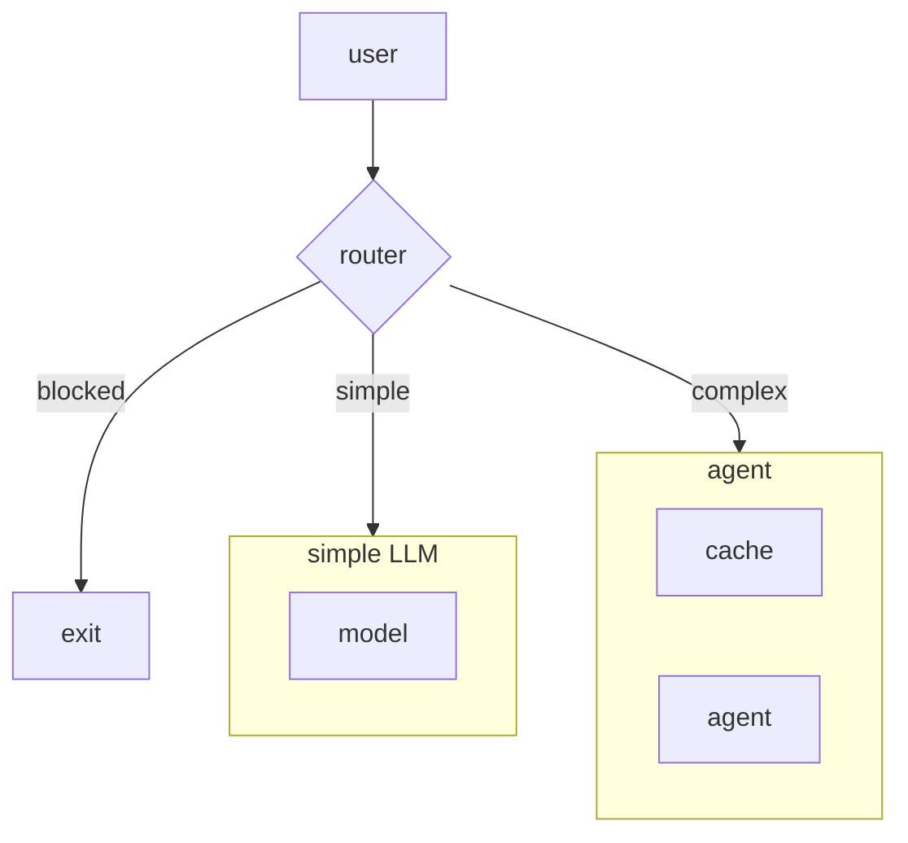
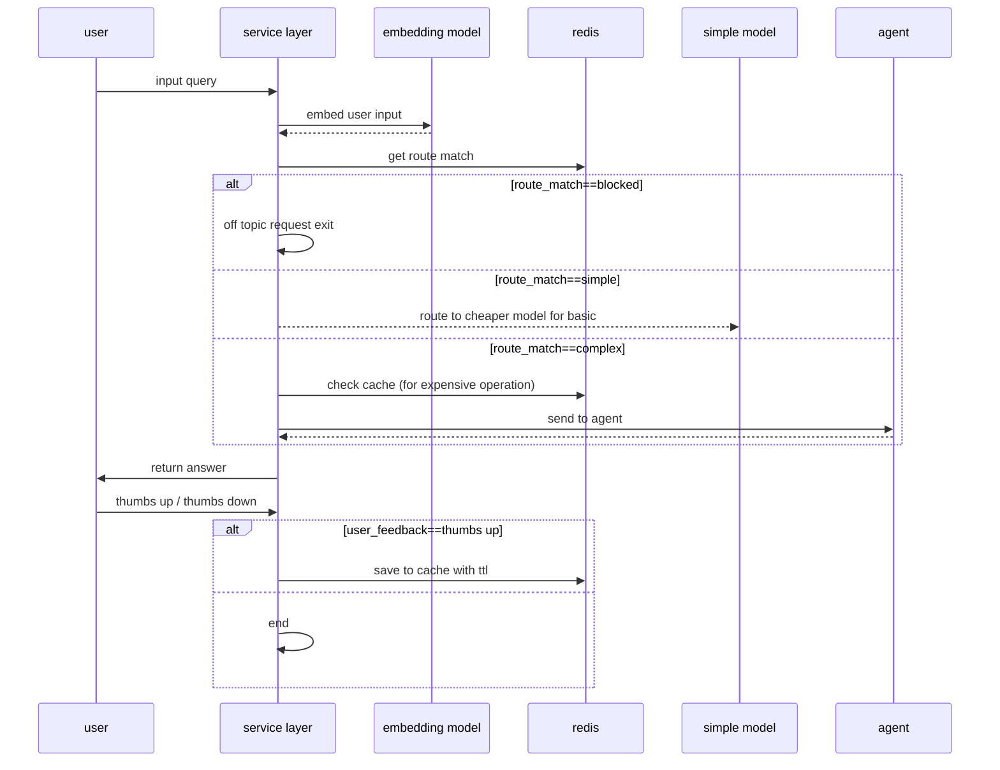
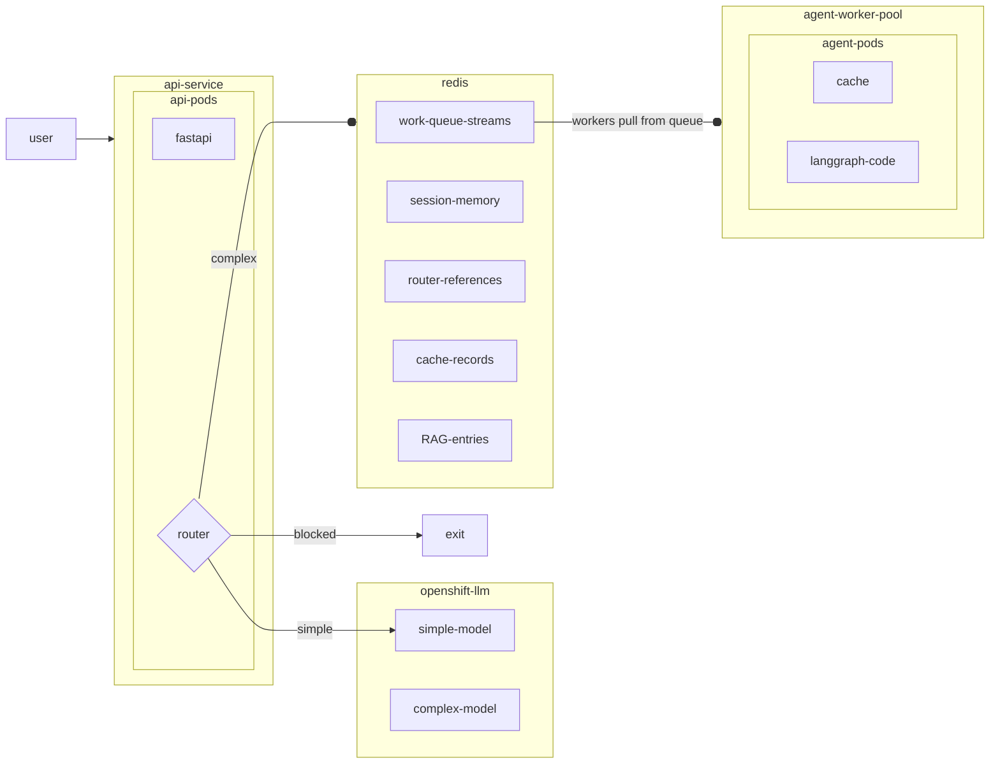
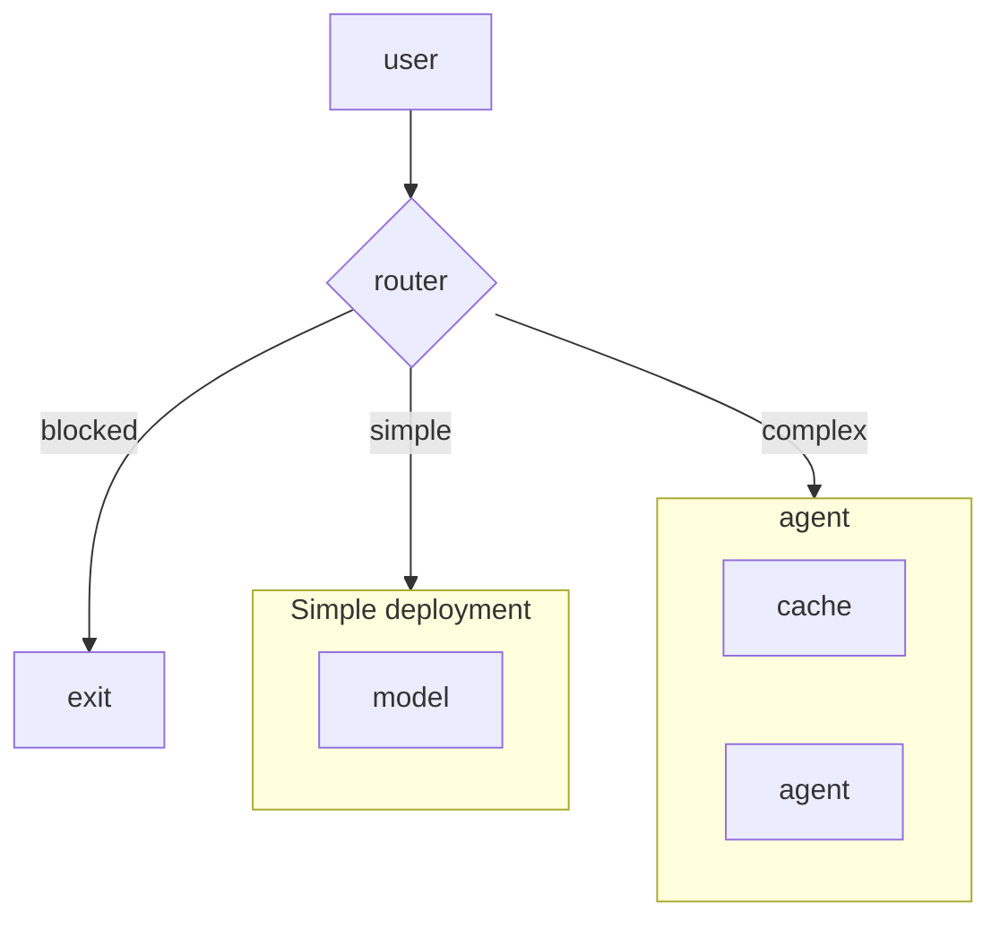

# Create a scalable and cost-efficient insurance agent with OpenShift AI and Redis

When starting out with AI systems, it's easy to lose track of the use case and miss out on pragmatic opportunities for optimization. Moreover, sound software architecture decisions still go a long way in making sure that what you're building doesn't get trapped in demo purgatory. This quickstart guide aims to focus on all the connective tissue it takes to build an effective AI app that you can feel confident running on the secure OpenShift AI platform, with the performance and reliability of Redis Enterprise.

## Overview

Let's imagine we are tasked with building an insurance claims assistant. The business metrics show that a high volume of questions are similar in nature and could be responded to quickly by an AI agent. However, given the rising costs from model providers, ops wants to make sure that token spend is being managed efficiently. Meanwhile, the engineering team is very excited to build out an agent workflow with LangGraph and all the bells and whistles.

From our interaction data, we know that not all input queries require the latest reasoning model to answer, and that there are likely many FAQ-type questions for which we don't need to constantly regenerate answers.

From our interaction data, we know that not all input queries require the latest reasoning model to answer and that there are likely many FAQ type questions for which we don't need to constantly regenerate answers.



The router in this diagram refers to the `SemanticRouter` made available from the [Redis vector library](https://redis.io/docs/latest/integrate/redisvl/), which uses a combination of vector-enabled search techniques to perform classification on the input query. Invoking a semantic router in this way runs in milliseconds and requires no LLM tokens for a quick first-cut intent detection. In this example, our three hypothetical routes will be `blocked`, `simple`, and `complex`, wherein simple or vague requests (like "hello" or "I need help") go to a cheaper non-reasoning LLM, more complex queries (like "I was curious if policy xyz applies in my state") go to the full-featured agent, and off-topic requests (like "answer my python coding question") get evicted.

In a similar vein, we will make use of the `SemanticCache` from the Redis vector library to store previously generated and approved responses from the agent to reduce repeat generations.

The final flow is encapsulated in the following sequence diagram:



In `demo/notebooks/`, `01_agent.ipynb` and `02_router_cache.ipynb` cover setting up this flow. The reusable agent used by `02_router_cache.ipynb` lives in `demo/shared/insurance_bot.py`.

## Production view

Finally, we want to provide insight into what managing a deployment like this on OpenShift would look like from a production standpoint, where a system like this has to be able to handle many concurrent requests. Notebook `03_async_work_queue.ipynb` shows how you can easily distribute your work across many horizontally scalable workers. In practice, this would enable an architecture with multiple workers backed by a distributed Redis layer for pods to retrieve semantic and episodic memory, as well as cached data.



## Deploy on OpenShift (Helm)

This repository includes a **Helm chart** under **`deploy/helm`** (chart name **`redis-notebook`**) that can install:

- a **Jupyter workbench** with a persistent workspace — by default a plain `Deployment` + `Service` + OpenShift `Route` (works on any OpenShift cluster), or a Kubeflow **`Notebook`** CR when `notebook.kind=Notebook` (requires **Red Hat OpenShift AI** / Open Data Hub),
- a **post-install Job** that clones this repo and copies **`demo/`** into the workspace,
- **Redis** via the **Redis Enterprise Operator** by default (`RedisEnterpriseCluster` + `RedisEnterpriseDatabase`); install the **redis-enterprise-operator-cert** package from OperatorHub into the release namespace first. Alternatives: in-chart **Redis Stack** (`redis.useRedisEnterpriseOperator=false`, `redis.builtin.enabled=true`), the **OT-CONTAINER-KIT** operator + Redis CR, or an **external** `REDIS_URL`.

**Cluster prerequisites:** the default `notebook.kind=Deployment` mode has no notebook-controller dependency — `oc` + `helm` against any OpenShift cluster is enough. Set `notebook.kind=Notebook` only if **RHOAI** (or upstream **ODH**) is installed; the chart fails fast with a friendly error otherwise. Quick check: `oc get crd notebooks.kubeflow.org`. The default **Redis Enterprise** path additionally requires the **redis-enterprise-operator-cert** OperatorHub package installed in the release namespace (`OwnNamespace` install mode); check with `oc get crd redisenterpriseclusters.app.redislabs.com`.

**Before `make deploy`:** create **`deploy/helm/values-secret.yaml`** (gitignored) from **`deploy/helm/values-secret.example.yaml`** and set real values for `secrets.model.apiKey` and the other `secrets.model.*` keys. **`make deploy`** runs **`check-secrets`** (file exists) and **`validate-secrets`** (merged values must not be null/empty for required fields; requires **PyYAML**: `python3 -m pip install pyyaml`).

The secrets YAML will look like this:
```bash
secrets:
  model:
    apiKey: "sk-proj-xxxxxxxxxxxxxxxxxxxxxxxxxxxxxxxxxxxxxxxx"
    endpoint: "https://api.openai.com"
    # Optional overrides (empty = use endpoint / apiKey for both):
    # simpleEndpoint: "https://..."
    # complexEndpoint: "https://..."
    # simpleApiKey: ""
    # complexApiKey: ""
    complexModelName: "gpt-5"
    simpleModelName: "gpt-4.1"
  redis:
    url: "redis://localhost:6379"

```

```bash
cp deploy/helm/values-secret.example.yaml deploy/helm/values-secret.yaml
# Edit deploy/helm/values-secret.yaml

make -f deploy/helm/Makefile help
make -f deploy/helm/Makefile deploy
```

Operator vs. builtin Redis, plain **`helm upgrade`** examples, RBAC, and troubleshooting: see **`deploy/README.md`**.

## Run locally

The `demo/` folder contains everything needed to exercise the router + cache + agent pattern against a local Redis instance and an OpenAI-compatible API.

**Prerequisites**

- Python 3.11+ (3.12 is fine)
- **Redis** reachable at `REDIS_URL` (default `redis://localhost:6379`). Use **Redis Stack** if you run **`02_router_cache.ipynb`** (the semantic router / cache needs search modules). **`01_agent.ipynb`** LangGraph multi-turn memory needs **`langgraph-checkpoint-redis`** (see `demo/scripts/requirements.txt`).
- An API key for your LLM provider (OpenAI by default; override **`MODEL_ENDPOINT`** for OpenShift AI / vLLM / Azure OpenAI–compatible hosts).

**1. Install dependencies**

```bash
cd Reducing-costs-of-AI-with-Redis-Labs
python -m venv .venv && source .venv/bin/activate
pip install -r demo/scripts/requirements.txt
```

**2. Configure the environment**

Create a `.env` file at the repository root:

```dotenv
MODEL_API_KEY=sk-...
MODEL_ENDPOINT=https://api.openai.com
SIMPLE_MODEL_NAME=gpt-4.1
COMPLEX_MODEL_NAME=gpt-5
REDIS_URL=redis://localhost:6379
```

**3. Run the notebooks**

```bash
jupyter lab demo/notebooks
```

Run from the **`demo/notebooks`** directory (or ensure that is the notebook working directory) so paths to `data/` and repo-root `.env` resolve as in the notebooks.

| Notebook | What it shows |
|---|---|
| `01_agent.ipynb` | The complex-path LangGraph agent with FAQ search, policy lookup, and Redis-backed multi-turn memory. |
| `02_router_cache.ipynb` | Wraps the agent with a `SemanticRouter` (blocked / simple / complex) and a `SemanticCache` populated only from 👍 user feedback. |

`01_agent.ipynb` builds the agent inline so every step is explicit; `02_router_cache.ipynb` imports the re-usable version of that same build from `demo/shared/insurance_bot.py`.

### Architecture diagrams



The router in this diagram refers to the `SemanticRouter` made available from the [redis vector library](https://redis.io/docs/latest/integrate/redisvl/) which uses a combination of vector enabled search techniques to perform classification on the input query. Invoking a semantic router in this way, runs in milliseconds and requires no LLM tokens for quick first cut intent detection. In this example, our three hypothetical routes will be `blocked`, `simple`, and `complex` wherein simple or vague requests (like "hello" or "I need help") go to a cheaper non-reasoning LLM and more complex queries (like "I was curious if policy xyz applies in my state") go to the full featured agent and off topic request (like "answer my python coding question") get evicted.

In a similar vein we will make use of the `SemanticCache` from the redis vector library to store previously generated and approved responses from the agent to reduce on repeat generations.

The final flow is encapsulated in the following sequence diagram:


In `demo/notebooks/`, `01_agent.ipynb` and `02_router_cache.ipynb` cover setting up this flow. The reusable agent build used by notebook 02 lives in `demo/shared/insurance_bot.py`.

## Production view

Finally, we want to provide insight into what managing a deployment like this on OpenShift would look like from a production standpoint where a system like this will have to be able to handle many concurrent requests. Notebook `03_async_work_queue.ipynb` shows how you can easily distribute your work between many horizontally scalable workers. In practice this would enable an architecture with multiple workers backed by a shared Redis queue in production.

## Deploy on OpenShift (Helm)

This repository includes a **Helm chart** under **`deploy/helm`** (chart name **`redis-notebook`**) that can install:

- an **OpenShift AI** Kubeflow **`Notebook`** workbench with a persistent workspace,
- a **post-install Job** that clones this repo and copies **`demo/`** into the workspace,
- **Redis Stack** in-cluster by default (suitable for **redisvl** / `02_router_cache.ipynb`), with optional **OT-CONTAINER-KIT** operator + Redis CR or an **external** `REDIS_URL` instead.

**Before `make deploy`:** create **`deploy/helm/values-secret.yaml`** (gitignored) from **`deploy/helm/values-secret.example.yaml`** and set real values for `secrets.model.apiKey` and the other `secrets.model.*` keys. **`make deploy`** runs **`check-secrets`** (file exists) and **`validate-secrets`** (merged values must not be null/empty for required fields; requires **PyYAML**: `python3 -m pip install pyyaml`).

```bash
cp deploy/helm/values-secret.example.yaml deploy/helm/values-secret.yaml
# Edit deploy/helm/values-secret.yaml

make -f deploy/helm/Makefile help
make -f deploy/helm/Makefile deploy
```

Operator vs builtin Redis, plain **`helm upgrade`** examples, RBAC, and troubleshooting: see **`deploy/README.md`**.

## Run locally

The `demo/` folder contains everything needed to exercise the router + cache + agent pattern against a local Redis instance and an OpenAI-compatible API.

**Prereqs**

- Python 3.11+ (3.12 is fine)
- **Redis** reachable at `REDIS_URL` (default `redis://localhost:6379`). Use **Redis Stack** if you run **`02_router_cache.ipynb`** (semantic router / cache need search modules). **`01_agent.ipynb`** LangGraph multi-turn memory needs **`langgraph-checkpoint-redis`** (see `demo/scripts/requirements.txt`).
- An API key for your LLM provider (OpenAI by default; override **`MODEL_ENDPOINT`** for OpenShift AI / vLLM / Azure OpenAI–compatible hosts)

**1. Install dependencies**

```bash
cd Reducing-costs-of-AI-with-Redis-Labs
python -m venv .venv && source .venv/bin/activate
pip install -r demo/scripts/requirements.txt
```

**2. Configure the environment**

Create a `.env` file at the repository root:

```dotenv
MODEL_API_KEY=sk-...
MODEL_ENDPOINT=https://api.openai.com
SIMPLE_MODEL_NAME=gpt-4.1
COMPLEX_MODEL_NAME=gpt-5
REDIS_URL=redis://localhost:6379
```

**3. Run the notebooks**

```bash
jupyter lab demo/notebooks
```

Run from the **`demo/notebooks`** directory (or ensure that is the notebook working directory) so paths to `data/` and repo-root `.env` resolve as in the notebooks.

| Notebook | What it shows |
|---|---|
| `00_initialization.ipynb` | Optional smoke test: env vars, Redis `PING`, and model endpoint checks. |
| `01_agent.ipynb` | Step-by-step LangGraph ReAct agent (FAQ, policy tools, Redis-backed checkpointer). |
| `02_router_cache.ipynb` | Imports `demo/shared/insurance_bot.py`: semantic router, thumbs-up–only semantic cache, agent with Redis memory. |
| `03_async_work_queue.ipynb` | Uses [redis-agent-kit](https://pypi.org/project/redis-agent-kit/) for an async Redis-backed work queue across workers. |
