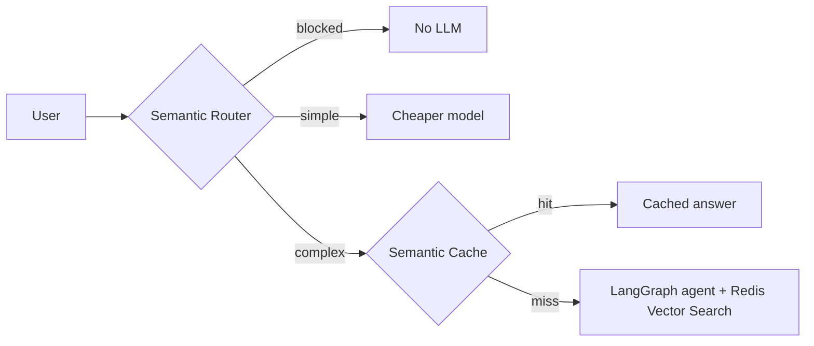

# UI-Based Demo Conversion Suggestions

This document summarizes the main purpose and functionality of the **Reducing-costs-of-AI-with-Redis-Labs** quickstart, and outlines five recommendations for converting (or completing) the project as a UI-first demo experience.

## Main Purpose and Functionality

**Reducing-costs-of-AI-with-Redis-Labs** is a Red Hat OpenShift AI + Redis Enterprise quickstart that demonstrates how to reduce LLM spend for an **insurance claims assistant** without sacrificing answer quality.

### The Business Problem

Insurance support receives many repeated, paraphrased questions (deductibles, required documents, rental coverage, etc.). Sending every question to a large reasoning model is slow and expensive. The demo shows how Redis vector features can **deflect or short-circuit** traffic before it hits the expensive path.

### Core Architecture (Three Cost Layers)



1. **Semantic Router** (`redisvl` `SemanticRouter`) — classifies queries into `simple`, `complex`, or `blocked` using vector similarity (no LLM tokens).
2. **Semantic Cache** (`SemanticCache`) — on the complex path, returns semantically similar approved answers before invoking the agent.
3. **Complex agent** — LangGraph ReAct agent with FAQ and policy tools backed by Redis Vector Search, plus Redis-backed conversation memory.

A **thumbs-up feedback loop** stores approved answers in the cache for future hits.

### Repository Structure

| Area | Role |
|------|------|
| `demo/notebooks/` | Original teaching path: `00` readiness, `01` agent, `02` router+cache, `03` async work queue |
| `demo/shared/` | Reusable pipeline (`insurance_bot.py`, `insurance_pipeline.py`, `insurance_worker.py`) |
| `demo/services/` | Preflight checks, cost/ROI metrics, queue client, agent runner |
| `demo/app.py` + `demo/ui/` | **Streamlit dashboard** with 4 tabs mirroring the notebooks |
| `deploy/helm/` | OpenShift deployment: Jupyter workbench, Redis Enterprise, optional ROI dashboard, optional RAK worker |

### Production Scaling Story

Notebook `03` and Tab 3 use **Redis Agent Kit (RAK)** — workers pull tasks from Redis Streams so the API/UI stays responsive under concurrent load.

### Current State

The project is **already partially UI-based**. `demo/app.py` is a multi-tab Streamlit app deployed via Helm as the **ROI dashboard** (`roiDashboard.enabled: true`). The main README still leads with notebooks as the primary local path. The suggestions below focus on making the UI the **primary demo experience** and filling gaps the notebooks still cover better.

---

## Five Suggestions to Convert to a UI-Based Demo

### 1. Make the Streamlit App the Single Entry Point

Today the README tells users to run `jupyter lab demo/notebooks`, while the UI lives in `demo/app.py` and is only documented in `deploy/README.md`.

**Conversion steps:**

- Add a **“Run the demo”** section to the main README with `streamlit run demo/app.py`.
- Reorder tabs into a **guided narrative**: Readiness → Baseline Agent (expensive) → Router & Cache (savings) → Production Queue.
- Add a sidebar **“Story mode”** that walks presenters through preset clicks (simple route, blocked prompt, cache miss → thumbs up → cache hit) so a conference demo needs no notebook.

Tab 2 already has preset buttons (`Simple`, `Blocked`, `Complex (cache miss)`, `Complex (cache hit)`). A scripted wizard on top would make this turnkey.

### 2. Add a Unified “Before vs After” ROI Dashboard as the Hero View

Tab 2 already tracks session cost (`total_saved`, `actual_spend`, `baseline_spend`, deflection counts). Pull that up front as a **landing ROI panel** so the value proposition is visible in the first 10 seconds.

**UI ideas:**

- Cumulative savings chart (actual vs always-complex baseline) using `SessionCostTotals.history`.
- Side-by-side comparison: run the same question on Tab 1 (always complex) and Tab 2 (routed) and show latency + cost delta.
- Export session report (CSV/JSON) for sales/engineering audiences.

This turns the demo from “try the pipeline” into “prove the business case.”

### 3. Replace Notebook-Only Workflows with Interactive Admin Panels

Several notebook flows are not yet fully exposed in the UI:

| Notebook concept | UI gap | Suggested panel |
|------------------|--------|-----------------|
| Cache warming from FAQ JSON | Manual in notebook | **“Warm cache”** button that loads `demo/notebooks/data/insurance_faq.json` into `SemanticCache` |
| Router threshold tuning | Hardcoded in `insurance_bot.py` | Sliders for `distance_threshold` on router routes and cache |
| Cache inspection | None | Table of cached entries in Redis with similarity scores and TTL |
| Agent tool traces | Partial in Tab 1 | Live step-by-step trace (router decision → cache lookup → tools invoked) |

A **“Configuration”** tab would let presenters tune behavior live without editing code or reopening notebooks.

### 4. Embed the Production Queue Story with One-Click Worker Orchestration

Tab 3 requires a manually started RAK worker:

```bash
rak worker --name insurance --tasks insurance_worker:tasks --concurrency 4
```

For a UI-first demo, hide that operational step behind the UI:

- **Option A:** Helm already supports `insuranceWorker.enabled` — surface worker health in Tab 0 preflight and auto-start guidance when the worker Deployment is missing.
- **Option B:** Add a **“Start demo worker”** control that spawns a background subprocess in local mode (or shows `oc get pods` status in cluster mode).
- **Option C:** Animate the production topology from the README mermaid diagram — highlight API pods, Redis Streams, and worker pods as Tab 3 tasks move through states.

This makes the “scale to production” story clickable instead of a separate terminal step.

### 5. Ship a Customer-Facing Chat UI Separate from the Engineering Dashboard

The current Streamlit app is an **operator/ROI dashboard** (metrics, routing badges, cost tables). For a stakeholder demo, add a thin **chat-only layer**:

- **Split views:** `Customer Chat` (clean insurance assistant) vs `Engineering Console` (route, cache hit, tokens, latency).
- Or a **FastAPI + React/Vite** frontend that calls the same `InsurancePipeline.handle()` API, with a debug drawer for Redis routing metadata.
- Deploy chat on a public Route and keep the ROI dashboard internal — matching the proposal’s “lightweight API + optional simple chat UI.”

`InsurancePipeline` and `insurance_worker.py` are already structured as a service layer; the UI conversion is mostly presentation and API wrapping.

---

## Quick Start (Existing UI)

### Run locally

```bash
cd Reducing-costs-of-AI-with-Redis-Labs
python -m venv .venv && source .venv/bin/activate
pip install -r demo/scripts/requirements.txt
# Configure .env with MODEL_API_KEY, REDIS_URL, etc.
streamlit run demo/app.py
```

### Deploy on OpenShift

```bash
make -f deploy/helm/Makefile deploy-with-roi-dashboard
make -f deploy/helm/Makefile route-roi-dashboard
```

See [deploy/README.md](../deploy/README.md) for full Helm deployment details.

---

## Related Documents

- [Main README](../README.md) — architecture, requirements, notebook overview
- [deploy/README.md](../deploy/README.md) — Helm chart, ROI dashboard deployment
- [redhat-insurance-semantic-cache-proposal.md](./redhat-insurance-semantic-cache-proposal.md) — original partnership proposal
